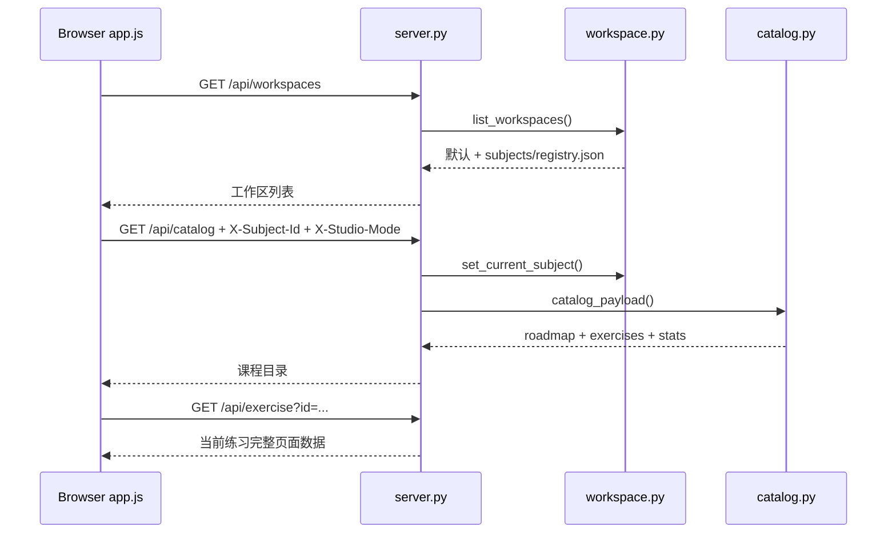

# Python Studio 程序框架与实现逻辑

> 适用版本：`python-studio 0.1.0`  
> 基线日期：2026-10-01  
> 本文覆盖：后端源码、HTTP 接口、SQLite 数据层、课程内容层、浏览器端、测试和现有扩展点。

## 1. 文档用途

这份文档回答四个问题：

1. 程序从哪个入口启动，请求如何流经各层。
2. 每个文件负责什么，修改一个功能时应该先看哪里。
3. 课程、练习、学习记录、AI 诊断、科目工坊和创造工坊之间怎样连接。
4. 哪些地方适合扩展，哪些地方是目前的高耦合点和已知边界。

推荐阅读顺序：

1. 第 3 节“一句话架构”
2. 第 5 节“运行时对象”
3. 第 6 节“模块职责地图”
4. 第 9 节“关键实现流程”
5. 第 13 节“定位问题速查”

## 2. 文档导航

非代码文档按职责分层：

```text
README.md                         用户入口和运行方式
docs/
├── README.md                     文档总索引
├── ARCHITECTURE.md               当前程序架构和实现逻辑
├── PLATFORM_ROADMAP.md           架构演进和已完成能力
├── FRONTEND_PRD.md               浏览器端产品与交互规范
├── UI_DESIGN_GUIDE.md            布局、视觉、组件和响应式执行规范
├── AI_COLLABORATION.md           学习者与 AI 协作约定
└── DOMAIN_AUTHORING.md           领域迁移和复用指南
curriculum/
├── README.md                     课程入口
├── OUTLINE.md                    模块路线
├── KNOWLEDGE_OUTLINE.md          完整知识点清单
└── EXERCISE_AUTHORING.md         练习编写和替换规范
```

修改代码行为或数据契约时，以本文档为准；修改产品交互时更新
[FRONTEND_PRD.md](FRONTEND_PRD.md) 和 [UI_DESIGN_GUIDE.md](UI_DESIGN_GUIDE.md)；
修改领域或课程内容时更新
[DOMAIN_AUTHORING.md](DOMAIN_AUTHORING.md) 和 [../curriculum/README.md](../curriculum/README.md)。

## 3. 一句话架构

Python Studio 是一个**零运行时第三方依赖、本地优先、单机单用户**的学习平台：

```text
浏览器 SPA（原生 HTML/CSS/JS）
        │ fetch
        ▼
ThreadingHTTPServer（server.py）
        │
        ├── 课程与练习目录（curriculum/exercises）
        ├── 执行层（checker/test_analysis/assessment）
        ├── 证据层（SQLite + progress.json）
        ├── AI 编排（companion/workshop/subject_compiler/materializer）
        └── 数据维护（backup/maintenance/knowledge_graph）
```

平台有三层“工作区”概念：

| 层级 | 示例 | 作用 |
| --- | --- | --- |
| 平台根目录 | `python-studio/` | 默认 Python 课程、全局设置、默认数据库 |
| 科目工作区 | `subjects/<subject-id>/` | 一个生成课程独立拥有课程、练习、进度、数据库和日志 |
| 练习目录 | `exercises/<id>/` | 一道练习的题面、起始代码、测试、答案和扩展 JSON |

浏览器通过两个请求头切换上下文：

- `X-Subject-Id`：当前科目工作区。
- `X-Studio-Mode`：`course` 或 `workshop`，用于区分课程记录与工坊记录。

## 4. 目录总览

```text
python-studio/
├── studio.py                     # 最外层启动脚本，注入 src 路径
├── pyproject.toml                # 包元数据、pytest/ruff 配置
├── studio.json                   # 平台名称、副标题、默认领域
├── progress.json                 # 默认工作区的轻量进度快照
├── network_check.py              # DeepSeek 网络链路诊断工具
├── docs/                         # 架构、产品、协作和领域指导
├── src/python_studio/            # 后端主代码
│   ├── cli.py                    # CLI 命令入口
│   ├── server.py                 # HTTP 路由、静态资源、业务编排
│   ├── services/                 # 学习记录与聊天服务层
│   ├── store.py                  # SQLite schema、迁移和所有查询
│   ├── workspace.py              # 科目工作区解析与 ContextVar
│   ├── catalog.py                # 路线和练习清单
│   ├── exercise_layout.py        # 题目分类、存储路径和模块关卡元数据
│   ├── checker.py                # 执行练习测试
│   ├── execution.py              # 受控本地进程、超时和输出上限
│   ├── test_analysis.py          # 测试输出到任务/知识点的映射
│   ├── assessment.py             # 选择题与文本题评分
│   ├── companion.py              # AI 审查、诊断、补练、聊天
│   ├── providers/                # 外部模型 Provider 适配
│   ├── practice_pack.py          # 受约束的 AI 练习包与测试代码生成
│   ├── subject_compiler.py       # 材料 → 课程蓝图
│   ├── materializer.py           # 课程蓝图 → 可运行练习
│   ├── workshop.py               # 对话生长的知识图谱
│   ├── authoring.py              # AI 可调用的内容写入工具
│   ├── ai_jobs.py                # AI 任务台账与缓存
│   ├── backup.py                 # 备份、恢复、删除
│   ├── maintenance.py            # 数据统计、清理、生成练习管理
│   ├── knowledge.py              # 内置讲义与覆盖顺序
│   ├── knowledge_graph.py        # 知识点关系和掌握快照
│   └── context_export.py         # 题目上下文压缩与 Markdown 导出
├── dashboard/                    # 无构建步骤的浏览器端
│   ├── core.js                   # API 请求、HTML 转义和 Markdown 渲染
│   ├── index.html                # 页面骨架和所有视图容器
│   ├── app.js                    # 状态、视图渲染和事件绑定
│   └── styles.css                # 设计令牌、布局、响应式与无障碍样式
├── domains/                      # 领域文件约定和检查命令
├── curriculum/                   # 默认 Python 课程路线和讲义
├── exercises/                    # 默认课程与 AI 动态练习
├── subjects/                     # 生成科目的独立工作区
├── tests/                        # 平台级回归测试
└── data/                         # 默认工作区数据库与备份（被 git 忽略）
```

题目存储按来源分类，但课程正式题与原题使用同一层目录：

```text
<workspace>/exercises/
├── <course_exercise_id>/         # 课程路线中的正式题
├── workshop/
│   └── <workshop_exercise_id>/   # 工坊节点生成的正式题
└── ai/
    └── <tutoring_exercise_id>/   # AI 诊断产生的补习题
```

生成题目的 `meta.json` 统一记录：

```text
subject_id / scope / origin
course_id / course_slug / course_title
module_id / module_number / module_title
level_index / level_id / storage_path
```

## 5. 运行时对象与作用域

### 5.1 SubjectWorkspace

定义位置：`src/python_studio/workspace.py`

`SubjectWorkspace` 是后端运行时的路径根对象。它把课程、练习、项目、数据库、进度和日志目录绑定到同一个科目。

```text
SubjectWorkspace
├── id                  python / <subject-id>
├── slug                文件系统目录名
├── title               显示名称
├── mode                programming / conceptual / hybrid
├── root                工作区根目录
├── curriculum_dir      roadmap.json 和知识大纲
├── exercises_dir       该科目的练习目录
├── projects_dir        项目目录
├── database_file       该科目的 SQLite
├── progress_file       该科目的 progress.json
└── journal_dir         学习日志
```

默认工作区是 `python`，直接使用项目根目录下的 `curriculum/`、`exercises/`、`data/study.db` 和 `progress.json`。

### 5.2 当前科目上下文

`workspace.py` 使用 `ContextVar[str]` 保存当前科目：

```text
HTTP 请求开始
  → 读取 X-Subject-Id
  → set_current_subject()
  → 后续 get_workspace() 自动返回该科目
  → HTTP 请求结束
  → reset_current_subject()
```

关键位置：

- 设置与重置：`server.py::StudioHandler.parse_request/finish`
- 获取路径：`workspace.py::get_workspace`
- SQLite 选择：`store.py::_connect`

这是多科目隔离的核心。新增后台线程、异步任务或测试时，必须显式携带科目 id，不能只依赖进程级全局状态。

### 5.3 双来源模式

`course` 和 `workshop` 共用科目，但记录来源不同：

- 生成练习的 `meta.json` 可包含 `origin: workshop`。
- `store.exercise_origin()` 决定记录落库时写入 `course` 还是 `workshop`。
- 历史、诊断和错题查询可传 `origin`。
- 课程目录仍会显示必要的生成练习，避免工坊产物从路线中消失。

## 6. 模块职责地图

### 6.1 启动与命令行

| 文件 | 主要职责 | 关键入口 |
| --- | --- | --- |
| `studio.py` | 设置 UTF-8 输出、把 `src/` 加入 `sys.path`、调用 CLI | 模块底部 `main()` |
| `src/python_studio/cli.py` | `serve/doctor/list/next/check/hint/progress/validate/normalize-layout` | `build_parser()`、`main()` |
| `src/python_studio/server.py` | HTTP 分发、静态文件、请求体解析、业务编排 | `StudioHandler`、`serve()` |

CLI 命令的含义：

| 命令 | 行为 |
| --- | --- |
| `serve` | 启动 `127.0.0.1:8765` 本地服务 |
| `doctor` | 检查 Python、Git、uv、VS Code 和默认练习数量 |
| `list` | 显示默认课程关卡 |
| `next` | 找第一个未完成关卡 |
| `check` | 运行单个练习并写入 `progress.json` |
| `hint` | 按层级输出提示 |
| `progress` | 输出默认课程完成度 |
| `validate` | 校验练习定义和 Python 语法 |
| `normalize-layout` | 为所有工作区题目补齐课程、模块、关卡和存储分类元数据 |

### 6.2 配置与领域

| 文件 | 主要职责 |
| --- | --- |
| `paths.py` | 定义所有全局路径常量 |
| `config.py` | `.env` 读取、DeepSeek 设置、代理、连通性测试 |
| `domain_profiles.py` | 加载 `domains/*.json`，解析练习覆盖项和检查命令 |
| `workspace.py` | 科目注册表、工作区创建和请求级作用域 |

领域配置决定：

- 起始文件名、测试文件名、答案文件名。
- 主检查命令和后备命令。
- 使用 `python_ast` 还是 `generic` 结果分析。
- 传给 AI 的学科背景。

练习 `meta.json` 可以覆盖领域默认值，例如 `starter_file`、`test_file`、`analysis_mode` 和 `test_command`。

### 6.3 内容目录与知识层

| 文件 | 主要职责 |
| --- | --- |
| `catalog.py` | 读取 `roadmap.json` 和所有 `meta.json`，构造目录 payload |
| `exercise_layout.py` | 统一题目分类、存储目录、模块关卡和范围元数据 |
| `knowledge.py` | 内置 Python 讲义、AI 讲义覆盖顺序 |
| `context_export.py` | 压缩题目上下文、生成 Markdown、限制聊天上下文大小 |
| `authoring.py` | 定义 AI 可调用的内容写入工具和执行器 |

讲义读取优先级：

```text
练习目录 lesson.json（AI 写入）
  > meta.json knowledge（生成练习内嵌）
  > knowledge.py 内置知识表
  > 题目 summary 兜底
```

### 6.4 执行与证据

| 文件 | 主要职责 |
| --- | --- |
| `checker.py` | 在练习目录运行领域检查命令，抓取代码快照、输出和耗时 |
| `execution.py` | 无 shell 启动本地进程，限制超时、输出和可用的系统资源 |
| `test_analysis.py` | 解析测试名和失败输出，映射到函数与知识点 |
| `assessment.py` | 选择题本地判分，文本题可选 AI 评分 |
| `progress.py` | 轻量 JSON 进度和统计 |
| `store.py` | SQLite schema、迁移、运行、审查、错题、聊天和工坊数据 |
| `knowledge_graph.py` | 从课程/练习同步知识点关系，刷新学生掌握快照 |

通过标准：

- 代码练习：子进程退出码为 `0`。
- 概念练习：所有选择题和文本题均达到通过阈值。
- 任一检查都会形成 `attempt`，并尽可能生成 `task_results`。

### 6.5 AI 编排

| 文件 | 主要职责 |
| --- | --- |
| `ai_jobs.py` | AI 调用缓存、任务状态、输入输出规模和耗时统计 |
| `companion.py` | 单次代码审查、批量诊断、动态补练、答案生成、聊天 |
| `providers/deepseek.py` | 统一模型请求、错误映射和 JSON 对象解析 |
| `practice_pack.py` | 校验模型题包，写入 `subject_id/origin/stage`，平台自行生成 `test_exercise.py` |
| `subject_compiler.py` | 把主题/材料编译为课程蓝图 |
| `materializer.py` | 把蓝图物化为编程题或概念题 |
| `workshop.py` | 把对话结果写为知识节点和边，并把节点物化为练习 |

所有模型能力都采用“模型失败 → 本地规则或本地题目兜底”的策略，因此未配置密钥时平台仍可运行。

伴学 AI 创建练习时会显式记录：

- `subject_id`：题目属于哪个科目工作区。
- `origin`：`course` 或 `workshop`。
- `stage`：课程模式必须匹配当前路线；无法匹配时映射到模块编号或 `ai_practice`。

这样同一科目的课程题目和工坊题目可以共用数据库，但不会混入对方的左侧导航。

### 6.6 服务层

| 文件 | 主要职责 |
| --- | --- |
| `services/learning_service.py` | 历史聚合、单条审查、批量失败审查、标准答案生成 |
| `services/assessment_service.py` | 概念题评分、运行记录落库和统计刷新 |
| `services/chat_service.py` | 会话与消息读写、上下文压缩、调用聊天 |

`server.py` 已把学习、聊天、诊断和概念题评估的一部分从路由中抽到服务层；其余路由仍有部分直接调用领域模块。

### 6.7 维护与可靠性

| 文件 | 主要职责 |
| --- | --- |
| `backup.py` | 备份 ZIP、恢复、恢复前保护性备份、路径穿越防护 |
| `maintenance.py` | 数据库统计、清理、生成练习归档/恢复/删除 |
| `network_check.py` | DNS、TCP、TLS、HTTP、Windows 保留端口逐层诊断 |
| `validation.py` | 练习元数据、必需文件和 Python 语法校验 |

### 6.8 浏览器端

| 文件 | 主要职责 |
| --- | --- |
| `dashboard/index.html` | 左栏、内容舞台、五个主视图和二级视图容器 |
| `dashboard/core.js` | API 客户端、HTML 转义和 Markdown 渲染 |
| `dashboard/app.js` | 全局 `state`、`elements`、视图渲染和事件绑定 |
| `dashboard/styles.css` | 设计令牌、组件样式、断点和 reduced-motion |

前端不使用框架、不打包、没有第三方依赖。`app.js` 的顶层结构是：

```text
state
  ↓
elements（DOM 引用表）
  ↓
api()（统一带科目和模式请求头）
  ↓
renderX() / loadX()
  ↓
事件绑定和 init()
```

## 7. HTTP 接口地图

### 7.1 GET 接口

| 路径 | 处理函数 | 返回内容 |
| --- | --- | --- |
| `/api/health` | `do_GET` | 健康状态 |
| `/api/tools` | `do_GET` | AI 内容写入工具清单 |
| `/api/catalog` | `do_GET` | 路线、练习、进度统计 |
| `/api/exercise?id=` | `_handle_exercise` | 题面、讲义、评估、协作建议和最近进度 |
| `/api/hint?id=&level=` | `_handle_hint` | 指定层级提示 |
| `/api/learning/history` | `_handle_history` | 运行记录和汇总 |
| `/api/companion` | `_handle_companion` | AI 状态、技能、诊断、错题 |
| `/api/maintenance` | `do_GET` | 数据量、AI 用量、备份和生成练习 |
| `/api/context/export` | `_handle_context_export` | 单题上下文和 Markdown |
| `/api/chat` | `_handle_chat_history` | 指定会话和消息 |
| `/api/chat/sessions` | `_handle_chat_sessions` | 会话列表 |
| `/api/maintenance/backups/download` | `_handle_backup_download` | ZIP 文件 |
| `/api/settings/ai` | `do_GET` | 非密钥 AI 设置 |
| `/api/studio` | `do_GET` | 平台身份 |
| `/api/subjects` | `do_GET` | 生成科目的清单 |
| `/api/workspaces` | `do_GET` | 所有工作区路径和模式 |
| `/api/workshop` | `do_GET` | 工坊消息、节点和边 |
| `/api/subject?id=` | `_handle_subject` | 科目清单与蓝图 |

### 7.2 POST 接口

| 路径 | 处理函数 | 主要动作 |
| --- | --- | --- |
| `/api/check?id=` | `_handle_check` | 运行代码练习并落库 |
| `/api/select?id=` | `_handle_select` | 记录最后选择的练习 |
| `/api/companion/analyze` | `_handle_companion_analysis` | 批量诊断并更新错题 |
| `/api/mistake/status` | `_handle_mistake_status` | 将错题标记为已掌握 |
| `/api/practice/generate` | `_handle_practice_generation` | 生成正式 AI 补练 |
| `/api/learning/analyze-attempt` | `_handle_attempt_analysis` | 审查单条代码 |
| `/api/learning/analyze-failures` | `_handle_failure_analyses` | 批量审查未处理失败 |
| `/api/learning/generate-solution` | `_handle_solution_generation` | 生成并保存标准答案 |
| `/api/maintenance/cleanup` | `_handle_cleanup` | 清理旧记录或已掌握错题 |
| `/api/maintenance/generated` | `_handle_generated_exercise` | 归档、恢复、删除生成练习 |
| `/api/chat/new` | `_handle_new_chat` | 新建会话 |
| `/api/chat/message` | `_handle_chat_message` | 发消息并保存回复 |
| `/api/chat/session` | `_handle_chat_session_action` | 重命名、清空、删除、设置上下文 |
| `/api/maintenance/backup` | `_handle_backup_create` | 创建备份 |
| `/api/maintenance/restore` | `_handle_backup_restore` | 恢复备份 |
| `/api/maintenance/backup/delete` | `_handle_backup_delete` | 删除备份 |
| `/api/settings/ai` | `_handle_ai_settings_update` | 写入 `.env` |
| `/api/settings/ai/test` | `_handle_ai_settings_test` | 测试模型连接 |
| `/api/studio` | `_handle_studio_update` | 更新平台身份 |
| `/api/subjects/compile` | `_handle_subject_compile` | 编译并可立即物化课程 |
| `/api/subjects/materialize` | `_handle_subject_materialize` | 重新物化课程 |
| `/api/assessment/check` | `_handle_assessment_check` | 提交概念题答案 |
| `/api/workshop/ask` | `_handle_workshop_ask` | 新问题并生长节点 |
| `/api/workshop/practice` | `_handle_workshop_practice` | 把节点变成练习 |

静态资源只从 `dashboard/` 提供，并使用 `resolve()` + `is_relative_to()` 阻止目录穿越。

## 8. 数据模型

### 8.1 两套进度存储

| 存储 | 位置 | 用途 |
| --- | --- | --- |
| `progress.json` | 工作区根目录 | 快速统计、最后练习、课程通过状态 |
| SQLite | `data/study.db` 或 `subjects/<slug>/data/study.db` | 完整证据、任务级结果、审查、聊天、工坊 |

两者都会在检查后更新，但职责不同：

```text
checker 结果
  ├── progress.record_attempt() → progress.json
  └── store.record_learning_attempt() → attempts/task_results
```

### 8.2 SQLite 表关系

```text
attempts
  ├── task_results（一次运行拆成多个测试/任务）
  └── attempt_analyses（一次运行对应一份 AI 审查）

mistakes
  └── 由诊断和补练建议维护，可标记 active/mastered

analysis_runs
  └── 保存历次整体诊断 JSON

chat_sessions
  └── chat_messages

workshop_sessions
  └── workshop_messages

thought_nodes
  └── thought_edges（父子或分支关系）

skills
  ├── exercise_skills
  ├── skill_prerequisites
  └── student_skill_state

ai_jobs
  └── AI 调用台账与耗时；ai_cache 保存可复用响应

subjects
  └── 旧版 SQLite 科目记录兼容表；当前主数据在 subjects/<slug>/subject.json
```

### 8.3 迁移机制

入口：`store.py::_connect`

```text
每次打开数据库
  → 创建 schema_migrations
  → 按序执行未应用迁移
  → 回填缺少 task_results 的旧运行
  → yield 连接
  → 正常提交 / 异常回滚
```

当前迁移：

| 版本 | 名称 | 作用 |
| --- | --- | --- |
| 1 | baseline_schema | 基础运行、错题、聊天表 |
| 2 | chat_context | 聊天上下文列 |
| 3 | ai_jobs_and_cache | AI 台账与缓存 |
| 4 | knowledge_graph | 技能、前置关系、掌握快照 |
| 5 | subject_compiler | 旧版科目表 |
| 6 | creative_workshop | 工坊会话、消息、节点和边 |
| 7 | origin_scope | 为运行、错题、诊断增加来源 |
| 8 | workshop_session_scope | 把工坊节点和边绑定到具体会话 |

新增数据库字段或表时，不要只改 `SCHEMA`。还要增加一个新版本迁移，确保已有数据库能升级。

## 9. 关键实现流程

### 9.1 页面启动



### 9.2 代码练习运行

```text
POST /api/check?id=...
  → server._handle_check
  → checker.run_exercise_check
      → catalog.find_exercise
      → domain_profiles.profile_for_exercise
      → 运行 pytest / unittest / 自定义检查命令
      → 保存 starter 代码快照
      → test_analysis.analyze_test_results
  → progress.record_attempt
  → store.record_learning_attempt
  → knowledge_graph.refresh_student_skill_state
  → server 返回输出、逐任务结果和统计
```

关键文件：

- 命令解析：[checker.py](../src/python_studio/checker.py)
- 任务映射：[test_analysis.py](../src/python_studio/test_analysis.py)
- 证据落库：[store.py](../src/python_studio/store.py)

### 9.3 概念题提交

```text
POST /api/assessment/check
  → assessment.load_assessment
  → 选择题：比较答案与 solution.json
  → 文本题：
      ├── 有模型：run_ai_operation("assessment_text_grading")
      └── 无模型：按回答长度给出本地基础分
  → 构造与代码练习相同的 attempt 结构
  → 写入 progress.json 和 SQLite
  → 前端刷新目录与当前练习
```

概念题复用代码练习的记录结构，这是“不同题型统一进入学习档案”的关键。

### 9.4 单条代码审查

```text
POST /api/learning/analyze-attempt?id=...
  → learning_service.analyze_attempt
  → 从 store 取 attempt
  → _enrich_attempt 补充 README、讲义和领域上下文
  → companion.analyze_attempt_code
      ├── DeepSeek：题目契约 + 代码 + 测试输出 → JSON 审查
      └── 本地规则：失败任务、print/return、TODO 占位
  → store.save_attempt_analysis
```

输出分为：

- `requirement_gaps`：与题目要求的差距。
- `code_issues`：当前代码的具体问题。
- `hidden_risks`：测试未覆盖的风险。
- `strengths`：已正确掌握的部分。

### 9.5 学习诊断与动态补练

```text
POST /api/companion/analyze
  → 取最近 attempt（按 origin）
  → 先审查未处理失败
  → companion.analyze_learning
      ├── 本地规则：按失败测试和函数聚合
      └── DeepSeek：结合时间线变化、代码审查和错题
  → replace_mistakes + save_analysis
  → 归档已经练习过的旧生成题

用户点击“再练”
  → POST /api/practice/generate
  → companion.generate_and_create_practice
  → practice_pack.normalize_practice_pack
  → practice_pack.create_practice_exercise
      ├── 平台生成 starter.py
      ├── 平台生成 test_exercise.py
      ├── 平台保存 cases.json
      └── 模型只提供题面和测试数据
```

安全边界：模型不直接决定测试代码。测试代码由平台模板生成，降低任意代码执行风险；学生代码仍在本地普通进程中运行，因此该项目当前只适合本机单用户场景。

### 9.6 课程编译与物化

```text
POST /api/subjects/compile
  → subject_compiler.compile_subject
      ├── 有模型：材料 → JSON 蓝图
      └── 无模型：本地模板蓝图
  → 规范化模式、模块、活动类型和字段
  → workspace.create_subject_workspace
      创建 subjects/<slug>/
  → materializer.materialize_subject
      ├── 写 roadmap.json 和 KNOWLEDGE_OUTLINE.md
      ├── programming/hybrid：生成代码练习
      └── conceptual/hybrid：生成 assessment.json 练习
  → 返回 subject id 和练习清单
```

支持的学习模式：

| 模式 | 物化方式 |
| --- | --- |
| `programming` | AI 题包目录，包含可运行代码和自动测试 |
| `conceptual` | 选择题 + 文本题 + 评分标准 |
| `hybrid` | 两种练习都生成 |

### 9.7 创造工坊

```text
用户提问
  → POST /api/workshop/ask
  → workshop.ask_workshop
      ├── 将当前问题、选中节点和已有图发送给模型
      ├── 无模型或调用失败：生成一个本地概念节点
      └── 写入 workshop_messages、thought_nodes、thought_edges
          （节点和边都带 session_id）
  → workshop._layout_graph 计算树形坐标
  → 前端 SVG 绘制

选择节点并生成练习
  → POST /api/workshop/practice
  → workshop.materialize_node_practice
      ├── concept/question/method/counterexample：概念题
      └── practice/project/example：代码题或实践题
  → 练习标记 origin=workshop、stage=workshop
  → 节点写入 exercise_id，防止重复生成
```

### 9.8 聊天与 AI 内容写入

```text
POST /api/chat/message
  → chat_service.send_chat_message
  → 压缩最多 4 份题目上下文
  → 保存用户消息
  → companion.chat_with_companion
      最多 4 轮工具调用
      └── authoring.execute_tool(origin=当前模式)
          ├── 列出/读取练习
          ├── 新建练习
          ├── 修改 README
          ├── 写 lesson.json
          ├── 写 mentor.json
          └── 写 diagnosis.json
  → 保存助手回复与工具回执
```

聊天上下文会剔除标准答案，并限制题目数量、题面、代码、输出和审查条数，避免上下文无界增长。

### 9.9 备份和恢复

```text
创建备份
  → sqlite backup API 复制数据库到临时文件
  → 打包 manifest.json + study.db + progress.json + journal
  → 写入 data/backups/*.zip

恢复备份
  → 自动创建 pre-restore 备份
  → 校验格式和 SQLite integrity_check
  → 复制数据库和 progress.json
  → 保留 .db.before-restore 副本
```

## 10. 前端实现逻辑

### 10.1 五个主视图

| 主视图 | DOM 容器 | 二级视图 |
| --- | --- | --- |
| 练习 | `#exerciseView` | 作答 / 讲义 / 协作 |
| 档案 | `#historyView` | 总览 / 诊断 / 补练 / 维护 |
| 伴学 | `#companionView` | 单一对话面 |
| 工坊 | `#workshopView` | 图谱 / 编译；编译内再分新建 / 列表 / 蓝图 |
| 设置 | `#settingsView` | 模型 / 平台 |

### 10.2 前端状态

`app.js` 顶层 `state` 是唯一状态容器，主要字段：

```text
catalog/current/history/companion/maintenance
activeSubjectId/appMode/view
chatSessionId/chatSessions/chatMessages/chatContexts
workshopSessionId/workshopSelectedNodeId/workshopGraph
historySubview/settingsSubview/workshopSubview
```

没有外部状态库。切换科目时手动清空当前对象、历史、诊断、维护、聊天和上下文，然后重新加载。

### 10.3 API 客户端

`dashboard/core.js::api()` 自动加入：

```text
Content-Type: application/json
X-Subject-Id: state.activeSubjectId
X-Studio-Mode: course | workshop
```

这要求所有新增接口都考虑当前科目和来源模式，否则会写到错误工作区或混合两类记录。

### 10.4 关键渲染函数

| 功能 | 函数 |
| --- | --- |
| 目录与路线 | `renderStats`、`renderRoadmap` |
| 练习页 | `renderExercise`、`renderAssessment` |
| 运行检查 | `runCheck`、`runAssessment` |
| 学习记录 | `renderHistory`、`renderHistoryOverview` |
| 诊断 | `renderAnalysis`、`renderMastery`、`renderCompanion` |
| 维护 | `renderMaintenance` |
| 聊天 | `renderChatMessages`、`renderChatContexts`、`loadChat` |
| 课程编译 | `renderBlueprint`、`loadSubjects`、`compileSubject` |
| 工坊图谱 | `renderThoughtGraphInto`、`selectWorkshopNode`、`fitWorkshopGraph` |
| 视图切换 | `switchView`、`switchSubview` |
| 响应式侧栏 | `applyRailState`、`setRailHidden`、`toggleMapOverlay` |

### 10.5 样式结构

`styles.css` 按以下区块组织：

1. 设计令牌
2. Reset 和基础样式
3. App shell：左栏 + 舞台
4. 练习视图
5. 档案和维护
6. 伴学聊天
7. 工坊和 SVG 图
8. 编译与设置
9. 响应式
10. 无障碍和 reduced-motion

断点：`1180 / 1080 / 900 / 760 / 520`。900px 以下左栏变为浮动抽屉。

## 11. 内容层扩展

### 11.1 新增一道手工代码练习

1. 创建 `exercises/<exercise_id>/`。
2. 添加 `meta.json`、`README.md`、`starter.py`、`test_exercise.py`、`solution.py`。
3. `meta.json` 至少包含 `id/title/stage/order/minutes/summary/concepts`。
4. `stage` 必须对应 `curriculum/roadmap.json` 中的 stage id。
5. 运行 `python studio.py validate`。
6. 运行 `python studio.py check <exercise_id>`。

参考：[curriculum/EXERCISE_AUTHORING.md](../curriculum/EXERCISE_AUTHORING.md)

### 11.2 新增领域

1. 添加 `domains/<domain>.json`。
2. 修改 `studio.json` 的 `default_domain`，或在练习 `meta.json` 指定 `domain`。
3. 定义文件约定、主命令、后备命令、分析模式和 AI 上下文。
4. 对非 Python 文本题，可使用 `generic` 分析模式和自定义检查脚本。

参考：[DOMAIN_AUTHORING.md](DOMAIN_AUTHORING.md)

### 11.3 新增数据库能力

1. 在 `SCHEMA` 中加入新表或字段，保证新数据库可直接建立。
2. 在 `store.py` 增加新版本迁移函数。
3. 把迁移追加到 `_connect()` 的迁移列表。
4. 永远不要修改已发布迁移的语义。
5. 为旧库升级写测试，例如 `tests/test_migrations.py`。

### 11.4 新增 API

1. 在 `server.py::do_GET` 或 `do_POST` 注册路由。
2. 把业务逻辑放入现有领域模块或 `services/`，路由只负责解析和响应。
3. 明确是否需要 `X-Subject-Id` 和 `origin`。
4. 对文件路径参数做 `resolve()` + 根目录边界检查。
5. 在前端 `api()` 调用处处理非 2xx 错误。

### 11.5 新增前端视图

1. 在 `index.html` 添加主视图或 `data-subview-group`。
2. 在 `app.js::elements` 注册 DOM 引用。
3. 在 `state` 中增加最小状态字段。
4. 写独立 `loadX()` 和 `renderX()`，不要把所有逻辑塞进事件监听器。
5. 在 `switchView()`、`refreshActiveView()` 和 `VIEW_HEADINGS` 中登记。
6. 使用现有按钮、面板、空状态和加载状态样式。

### 11.6 新增 AI 操作

1. 为操作定义稳定的 `kind`。
2. 使用 `run_ai_operation(kind, payload, operation, use_cache=...)` 包裹调用。
3. 保证 payload 可 JSON 序列化且不包含密钥。
4. 提供本地兜底结果。
5. 对模型输出做字段限制、JSON 解析和类型校验。
6. 在维护页 AI 用量统计中自动获得该次任务记录。

## 12. 测试地图

| 测试 | 覆盖内容 |
| --- | --- |
| `test_ai_jobs.py` | 缓存、任务统计 |
| `test_assessment.py` | 选择题评分 |
| `test_backup.py` | 备份恢复、密钥排除、路径穿越 |
| `test_config.py` | `.env` 保存、密钥保留/清除、URL 限制 |
| `test_context_export.py` | 聊天上下文压缩 |
| `test_domain_profiles.py` | 领域加载、平台设置、命令覆盖 |
| `test_execution.py` | 进程超时、输出捕获和截断 |
| `test_generation_scope.py` | 生成题目的科目、来源、stage、目录和未归类兜底 |
| `test_knowledge_graph.py` | 技能和前置关系同步 |
| `test_maintenance_scope.py` | 维护和生成练习的工作区隔离 |
| `test_migrations.py` | 迁移只执行一次 |
| `test_provider.py` | Provider JSON 提取和错误边界 |
| `test_store_chat.py` | 聊天会话隔离 |
| `test_subject_compiler.py` | 模式判断和科目保存 |
| `test_workshop.py` | 节点生长、练习生成、工作区隔离 |
| `test_workshop_migrations.py` | 旧工坊图表的 session_id 回填 |
| `test_workspace.py` | 多科目路径、数据库和进度隔离 |

常用验证命令：

```powershell
python -m pytest -q
python studio.py validate
python studio.py doctor
python studio.py progress
python studio.py check <exercise-id>
python studio.py normalize-layout
python network_check.py
```

当前基线结果：

- `python -m pytest -q`：`33 passed`
- `python studio.py validate`：26 个练习定义，无错误
- 已知警告：3 个生成练习缺少 `solution.py`；1 个生成练习的 learner code 含中文引号语法错误

## 13. 定位问题速查

| 现象 | 首先查看 |
| --- | --- |
| 页面打不开或端口占用 | `cli.py::main`、`server.py::serve` |
| 切换科目后仍看到旧数据 | `workspace.py`、`app.js::switchSubject`、`X-Subject-Id` |
| 课程列表缺失或顺序错误 | `catalog.py`、`curriculum/roadmap.json`、`meta.json` |
| 检查命令不执行或命令错误 | `domain_profiles.py`、`checker.py`、`meta.json` |
| 测试通过但任务结果不正确 | `test_analysis.py` |
| 运行后历史没有记录 | `progress.py`、`store.record_learning_attempt` |
| AI 审查为空或错位 | `services/learning_service.py`、`companion.py`、`attempt_analyses` |
| AI 诊断重复调用 | `ai_jobs.py` 缓存键、`origin`、任务 payload |
| 动态补练无法创建 | `companion.generate_and_create_practice`、`practice_pack.py` |
| 概念题不显示或无法评分 | `materializer._write_assessment_exercise`、`assessment.py` |
| 课程生成后没有练习 | `subject_compiler.py`、`materializer.materialize_subject` |
| 工坊节点位置重叠 | `workshop._layout_graph`、`renderThoughtGraphInto` |
| 聊天上下文太长 | `context_export.compact_chat_contexts` |
| 备份或恢复找不到数据 | `backup.py`、当前工作区是否为默认工作区 |
| AI 连接失败 | `config.describe_network_error`、`network_check.py` |

## 14. 架构状态与后续边界

这些不是立即必须修复的问题，而是后续开发前应优先知道的事实。

### 14.1 `server.py` 仍然接近“总编排器”

学习、聊天和概念题评估已拆出 `services/`，诊断编排也已进入服务层。课程编译、工坊、维护、备份和设置仍有部分直接写在 Handler 中。新增接口时不要把复杂业务继续堆进 Handler，优先提取服务函数。

### 14.2 `companion.py` 是多能力集合

网络调用和 JSON 解析已经抽到 `providers/deepseek.py`，`companion.py` 变短，但审查、诊断、动态出题、答案生成和聊天工具循环仍在同一文件中。后续可按以下边界继续拆分：

```text
providers/deepseek.py
services/attempt_review.py
services/learning_diagnosis.py
services/practice_generation.py
services/chat.py
```

### 14.3 多科目维护和备份作用域（已修复）

已修复。`backup.py` 和 `maintenance.py` 现在从当前 `SubjectWorkspace` 解析数据库、进度、练习和备份目录；ZIP 包含工作区标识、进度、journal 和科目清单，恢复时会拒绝跨工作区备份并恢复 journal。

### 14.4 `catalog_payload(origin=...)` 的语义（已统一）

已修复。`course` 目录包含课程和 AI 补练，`workshop` 目录只包含工坊来源练习；记录来源与目录可见性使用同一套 `origin` 规则。

### 14.5 工坊会话和节点隔离（已修复）

已修复。第 8 版迁移为 `thought_nodes` 和 `thought_edges` 增加 `session_id`，现有数据回填到默认会话；查询、写入和物化练习都按会话语义工作。

### 14.6 模型输出是外部输入

现有实现已经做了 JSON 提取、字段限制、函数名校验、平台生成测试代码和 Python 语法校验，但仍然应始终把模型输出当作不可信数据：

- 不执行模型生成的测试代码。
- 不接受模型直接传入文件路径。
- 新字段必须做类型、长度和枚举校验。
- 不把模型说明当作系统指令。

### 14.7 学生代码仍在本机普通进程执行

`checker.py` 已统一使用 `execution.py`，关闭 shell、隔离标准输入、限制输出大小，并在 POSIX 平台附加 CPU、内存、文件大小和文件描述符限制。Windows 仍主要依赖超时和进程终止；它仍不是容器级沙箱，也不提供网络和文件系统隔离，不适合直接扩展为公网远程判题服务。

### 14.8 AI 请求是同步 HTTP 调用

`ai_jobs` 记录任务状态，但没有后台队列。长模型调用会占用 HTTP 请求线程。后续若增加批处理或大材料课程，建议引入本地任务队列和前端轮询。

### 14.9 前端仍是单文件状态容器

`dashboard/app.js` 约 2900 行，`styles.css` 约 3000 行。API 客户端、HTML 转义和 Markdown 已抽到 `dashboard/core.js`；继续扩展前可按视图域拆分，但保持无构建步骤的产品约束：

```text
dashboard/js/practice.js
dashboard/js/history.js
dashboard/js/chat.js
dashboard/js/workshop.js
dashboard/js/settings.js
```

## 15. 建议的开发顺序

在不改变产品边界的前提下，推荐后续重构顺序：

1. 把课程、工坊、维护路由的业务逻辑继续移入服务层。
2. 把 `companion.py` 按审查、诊断、出题和聊天继续拆分。
3. 把 `dashboard/app.js` 按练习、档案、聊天和工坊拆分。
4. 为生成练习增加统一 JSON Schema 和过期清理策略。
5. 为 AI 操作增加可选后台队列、取消和前端轮询。
6. 增加 Windows 进程树终止和可选的容器化判题后端。
